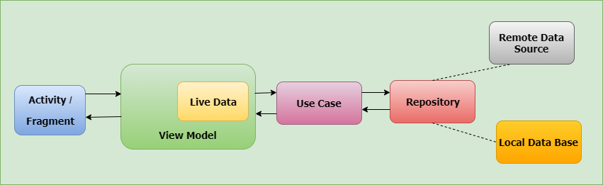

# Awesome App Movie

### Introduction
### Buatlah satu aplikasi android (berisi 2 halaman) dengan ketentuan sebagai berikut :
  * Aplikasi Android terintegrasi dengan API MovieDB
  * Halaman pertama terdiri dari 3 Fragment (Popular Movie, Now Playing Movie, Upcoming Movie)
  * Setiap Fragment dapat melakukan infinite scrool (pagination dengan limit 10/page)
  * Pada activity terapkan search bar function untuk me filter list
  * Halaman kedua terdiri dari detail setelah klik salah satu item pada list fragment.

This application written in kotlin

### Architecture
Clean Architecture

Clean Architecture + MVVM (model view viewmodel)

